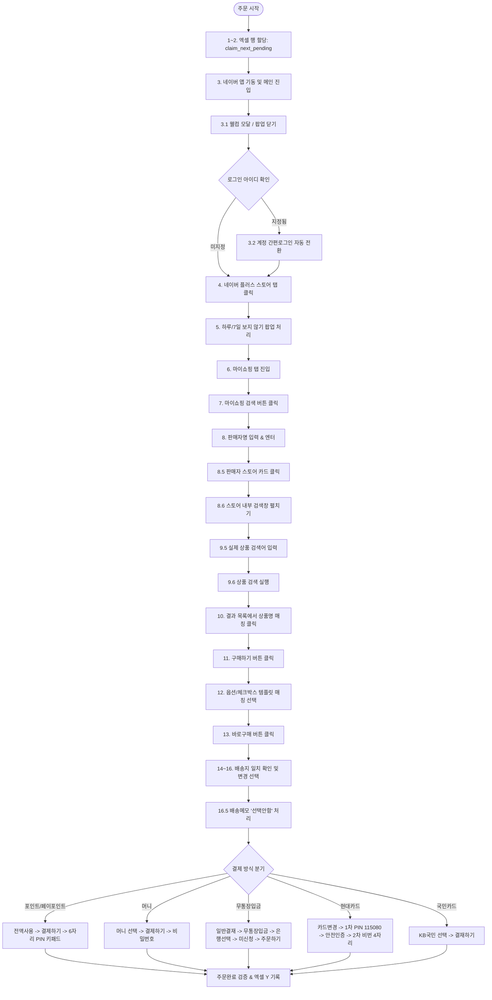
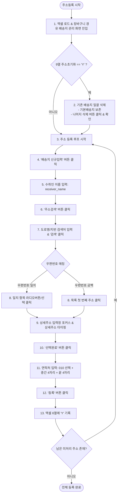

# 네이버 자동화 시스템 (자동주문 & 자동주소등록) 개발 상세 명세서

본 문서는 네이버 모바일 쇼핑 앱을 대상으로 **Appium** 및 **ADB**, **OpenCV 컴퓨터 비전** 기술을 활용하여 구현된 **자동주문 시스템**과 **자동주소등록 시스템**의 전체 소프트웨어 구조, 아키텍처, 데이터 흐름, 핵심 알고리즘 및 단계별 워크플로우를 정리한 공식 개발 문서입니다.

---

## 1. 시스템 개요 및 아키텍처

### 1.1 시스템 목적
- **자동주문**: 다수의 단말기(스마트폰)를 통해 네이버 쇼핑에서 엑셀(`결재목록.xlsx`)에 정의된 상품을 검색하고, 지정된 배송지를 선택한 뒤 설정된 결제 수단(포인트, 머니, 무통장입금, 현대카드, 국민카드 등)으로 결제까지 전 과정을 무인 자동화합니다.
- **자동주소등록**: 엑셀(`주소록.xlsx`)에 정의된 수취인, 도로명/지번 주소, 우편번호, 연락처를 기반으로 네이버 배송지 관리 시스템에 주소를 일괄 등록하며, 필요 시 기존 배송지(기본배송지 제외)를 일괄 삭제 초기화합니다.

### 1.2 전체 아키텍처 다이어그램

```
+--------------------------------------------------------------------------------------------------+
|                                    GUI & Scheduler Layer                                         |
|  - main_order.py (주문 메인 GUI)                   - naver_address_auto/main.py (주소 메인 GUI)   |
|  - PrioritySlotManager (작업량 기반 우선순위 제어)      - DynamicSemaphore (동시 실행 세마포어)     |
|  - SysOutQueueWriter / 배치 로그 큐 (UI 멈춤 방지)   - 화면 상시 켜짐 감시 (wake_and_keep_screen_on)|
+--------------------------------------------------------------------------------------------------+
                                                 |
                   +-----------------------------+-----------------------------+
                   v                                                           v
+------------------------------------+                      +------------------------------------+
|       [모듈 1] 자동주문 엔진         |                      |      [모듈 2] 자동주소등록 엔진      |
|  - naver_order_worker.py           |                      |  - naver_address_auto/naver_worker |
|  - OrderManager (결재목록.xlsx)     |                      |  - AddressManager (주소록.xlsx)    |
|  - 19단계 주문 파이프라인           |                      |  - 장바구니 경유 배송지 관리 진입  |
|  - 결제방식별 분기 처리             |                      |  - 기본배송지 외 일괄 삭제         |
|  - 네이버 계정 자동 전환 (3.2)      |                      |  - OCR/우편번호 매칭 등록          |
+------------------------------------+                      +------------------------------------+
                   \                                                           /
                    +----------------------------+----------------------------+
                                                 v
+--------------------------------------------------------------------------------------------------+
|                                Hardware & Platform Automation Layer                              |
|  - naver_appium.py / appium_helper.py (드라이버 생성, XPath 탐색, 좌표 탭, 키이벤트 처리)          |
|  - OpenCV 템플릿 매칭 엔진 (matchTemplate, CCOEFF_NORMED, 임계값 튜닝, ROI 크롭)                |
|  - ADB Subprocess 인터페이스 (input tap, swipe, screencap, clipboard, settings)                 |
|  - Android 단말기 군 (USB / 무선 디버깅 다중 연결)                                               |
+--------------------------------------------------------------------------------------------------+
```

---

## 2. 파일 및 디렉토리 구조

```
네이버자동주문/
│
├── main_order.py                 # 자동주문 메인 GUI (Tkinter 다중 기기 실시간 모니터링)
├── naver_order_worker.py         # 자동주문 워커 (Appium 제어, 19단계 주문 파이프라인, 결제 분기)
├── order_manager.py              # 결재목록.xlsx 인메모리 관리 및 비동기 쓰기 큐
├── run_order.bat                 # 자동주문 간편 실행 배치 파일
│
├── 개발문서/
│   ├── 결재목록.xlsx              # 주문 대상 데이터 파일
│   ├── 검색입력.png, 검색2.png     # 검색창 인식 템플릿 이미지
│   ├── 바로구매.png, 체크박스.png   # 장바구니/구매 버튼 템플릿 이미지
│   ├── 전액사용.png, 결재하기.png   # 결제 화면 제어 이미지
│   ├── 숫자/ (p0.png ~ p9.png)   # 포인트/머니 결제 비밀번호 키패드 템플릿
│   ├── 현대카드/                 # 현대카드 카드번호 템플릿 (333.png, 591.png 등)
│   ├── 현대숫자/ (0.png ~ 9.png)  # 현대카드 1차 PIN / 2차 비밀번호 키패드 템플릿
│   └── 260925개발.md, 개발리스트.md# 개발 히스토리 및 명세서
│
└── naver_address_auto/           # 자동주소등록 모듈 디렉토리
    ├── main.py                   # 자동주소등록 메인 GUI
    ├── naver_worker.py           # 주소등록 워커 (장바구니 진입, 주소삭제, 신규등록)
    ├── address_manager.py        # 주소록.xlsx 인메모리 관리 및 비동기 쓰기 큐
    ├── naver_appium.py           # Appium 드라이버 및 단말기 제어 유틸리티
    ├── appium_helper.py          # Appium 저수준 헬퍼
    ├── devices_config.json       # 기기별 설정 (ADB ID, 포트, 비고, 선택 상태)
    ├── 주소록.xlsx                # 등록할 배송지 데이터 파일
    └── 개발문서.txt               # 주소등록 요구사항 명세
```

---

## 3. 데이터 구조 및 엑셀 명세

### 3.1 결재목록.xlsx (자동주문용)
헤더 1행을 정규화하여 지능형 채점 방식으로 컬럼을 자동 감지합니다.

| 필드명 | 내부 컬럼 키 | 감지 키워드 | 설명 |
|--------|--------------|-------------|------|
| 검색어 | `search_keyword` | 검색어, searchkeyword, keyword | 상품 검색 키워드 (몰 내 검색 시 사용) |
| 판매자명 | `seller_name` | 판매자명, 판매자, seller, 스토어명 | 스토어 탐색 키워드 (1차 검색) |
| 상품명 | `product_name` | 매칭상품명, 상품명, productname | 스토어 내에서 매칭할 실제 상품명 |
| 수취인 | `recipient_name` | 수취인, 수령인, recipient, 받는사람 | 배송지 목록에서 선택할 수취인명 |
| 전화번호 | `phone` | 전화번호, 연락처, phone | 배송지 매칭 검증용 전화번호 |
| 비밀번호 | `password` | 비밀번호, password, 암호 | 결제 6자리 비밀번호 (포인트/머니) |
| 완료여부 | `status` | 완료여부, 완료, 상태, status | 진행 상태 코드 (아래 상태 코드 표 참고) |
| 결제방식 | `payment_method` | 결제방식, 결재방식, payment | 포인트 / 머니 / 무통장 / 현대카드 / 국민카드 |
| 폰ID | `device_id` | 폰id, 기기id, device_id | 작업을 전담할 ADB 기기 시리얼 (공백 시 임의 할당) |
| 로그인아이디 | `login_id` | 로그인아이디, 로그인id, login_id | 주문 전 자동 전환할 네이버 계정 ID |
| 2차비밀번호 | `second_password` | 2차비밀번호, 2차비번 | 현대카드 2차 인증 4자리 비밀번호 |
| 카드번호 | `card_number` | 카드번호, card_number, 카드 | 현대카드 특정 카드 식별값 (예: 591, 333, 80) |

#### 완료여부 상태 코드 (`status`)
- **공백 / None / 대기**: 미처리 작업 (워커가 우선순위에 따라 가져감)
- **`W` (Working)**: 현재 워커가 선점하여 작업 진행 중 (중복 할당 방지)
- **`Y` (Success)**: 주문 정상 완료 (수동시작 모드는 배송지 선택 후 Y)
- **`F` (Failed)**: 요소 미발견, 매칭 실패 등 오류
- **`B` (Birthday Auth)**: 현대카드 본인인증(이름/생년월일) 요구로 추가 인증 필요
- **`C` (Cancelled)**: 사용자가 GUI에서 작업 정지 클릭
- **`H` (Connection Failed)**: Appium 포트 연결 거부 (WinError 10061 등)
- **`E` (Driver Error)**: UiAutomator2 세션 소실 및 드라이버 크래시

---

### 3.2 주소록.xlsx (자동주소등록용)
컬럼 순서(1-based 인덱스) 기준 매핑 구조입니다.

| 컬럼 인덱스 | 필드명 | 설명 |
|-------------|--------|------|
| 1열 | 수취인 | 배송받을 사람 이름 (`receiver_name`) |
| 2열 | 주소 검색어 | 도로명 또는 지번 검색 키워드 |
| 3열 | 우편번호 | 5자리 우편번호 (리스트 매칭 또는 OCR 검증) |
| 4열 | 휴대폰 번호 | 수취인 연락처 (중간 4자리, 끝 4자리 자동 분할) |
| 5열 | 상세 주소 | 동/호수 등 상세 주소 |
| 6열 | 작업 상태 | 공백=미작업, `Y`=성공, `F`=실패, `H`=연결실패, `E`=드라이버에러 |
| 7열 | 폰ID | 작업할 단말기 시리얼번호 |
| 9열 | 주소초기화 | `Y`일 경우 배송지 등록 전 기본배송지 제외 전 주소 일괄 삭제 |
| 11열 | 네이버아이디 | 계정 전환 대상 ID |

---

## 4. [모듈 1] 자동주문 상세 구조 및 워크플로우

### 4.1 주문 실행 단계 요약 (19단계 + 확장)



---

### 4.2 단계별 상세 구현 로직

#### [단계 1~2] 데이터 할당 및 동시성 제어
- `OrderManager.claim_next_pending(device_id)`를 호출하여 원자적(Atomic)으로 미처리 행을 선점하고 상태를 `W`로 변경합니다.
- `PrioritySlotManager`가 전체 기기 중 미처리 잔여량이 많은 기기부터 슬롯(기본 30대 한도)을 우선 배정합니다.

#### [단계 3 ~ 3.2] 메인 진입, 모달 닫기, 네이버 계정 전환
- 앱 시작 후 `joinBeginWelcomeModal`, `btnWelcomeClose` 등 웰컴 모달을 감지하여 닫습니다.
- **3.2 계정 자동 전환 (`_switch_account`)**:
  1. 메뉴(GNB) -> 설정 버튼 클릭
  2. '로그인 아이디 관리' 진입
  3. 엑셀의 `login_id`와 등록된 간편로그인 목록 비교 (오타 보정: SequenceMatcher 0.85 이상 또는 8자 이상 공통 접두사 지원)
  4. 타겟 계정 탭 (좌표 기반 ADB tap 지원으로 clickable 속성 우회)
  5. 전환 확인 팝업(`android:id/button1`) 클릭 후 `로그인 중` 상태 검증
  6. 완료 후 네이버 앱 강제 재시작 및 UiAutomator2 안정화 대기 (`_wait_for_uiautomator_ready`)

#### [단계 4 ~ 7] 스토어 홈 및 마이쇼핑 검색 진입
- 네이버 플러스 스토어 탭 클릭 (`com.nhn.android.search:id/tabIcon`)
- '하루 동안 보지 않기', '7일간 보지 않기' 등 가림막 팝업을 bounds 중앙 좌표 ADB 탭으로 제거
- 마이쇼핑 탭 클릭 후 화면 하단 검색 버튼(`bounds=[417,2052][630,2220]`) 클릭

#### [단계 8 ~ 10] 260925 개편 스토어 경유 검색 및 상품 선택
- **1단계 (판매자 스토어 찾기)**:
  - 검색창에 `seller_name`을 클립보드 붙여넣기 방식으로 입력 후 KeyEvent 66(엔터) 전송
  - 검색 결과에서 판매자 스토어 카드를 매칭하여 스토어 홈 진입
- **2단계 (스토어 내 상품 검색)**:
  - '검색창 펼치기' 또는 '검색어를 입력해주세요' 버튼 클릭 (`_open_mall_search_box`)
  - 엑셀의 실제 상품 검색어(`search_keyword`) 입력 후 엔터
- **3단계 (상품 카드 매칭)**:
  - 스토어 내 검색 결과에서 `product_name` 텍스트를 포함하는 View 요소를 찾아 클릭

#### [단계 11 ~ 13] 구매하기, 옵션 선택, 바로구매
- 구매하기 버튼(`BUY_BTN_XPATH`) 클릭
- **옵션 선택 (`_click_checkbox`)**:
  - 체크박스 템플릿(`체크박스.png`, `체크박스2.png`, `체크박스4.png` 등)을 화면 하단 50% 영역에서 탐색
  - 미체크 회색 박스 대비 고려 임계값(0.70 ~ 0.80) 다중 적용
  - 드롭다운 옵션이 있는 경우 옵션 라벨 탭 후 첫 번째 항목 선택
- 바로구매 버튼(`바로구매.png` ~ `바로구매6.png`) 템플릿 매칭 클릭

#### [단계 14 ~ 16] 배송지 검증 및 변경
- 현재 화면의 배송지 수취인명과 전화번호가 목표 데이터와 일치하는지 사전 확인 (`_check_current_delivery_address`)
- 불일치 시 '변경' 버튼 클릭 후 배송지 목록 진입
- 배송지 목록을 스크롤하면서 수취인명과 전화번호 뒤 4자리가 일치하는 카드의 '선택' 버튼 탭
- **수동시작 모드 분기**: 사용자가 GUI에서 [수동시작]을 누른 경우, 결제 직전 배송지 선택까지만 완료하고 결제를 진행하지 않은 채 엑셀에 `Y`를 기록하고 안전 종료

#### [단계 16.5] 배송메모 처리
- 배송메모 드롭다운(`배송메모.png`) 감지 시 클릭 후 '선택안함'(`선택안함.png`)을 선택하여 불필요한 입력 팝업 방지

---

### 4.3 결제 수단별 세부 프로세스

```
+----------------------------------------------------------------------------------------------------+
| 1. 포인트 / 페이포인트 결제                                                                         |
|    - 전액사용.png 인식 후 클릭 (3초 대기)                                                             |
|    - 결제하기 버튼 클릭                                                                             |
|    - 6자리 PIN 번호 키패드 매칭 (p0.png ~ p9.png 순차 탐색 후 ADB 좌표 탭)                           |
+----------------------------------------------------------------------------------------------------+
| 2. 머니 (Naver Pay Money) 결제                                                                     |
|    - 머니.png / pay머니.png 매칭 후 클릭                                                             |
|    - 결제하기 버튼 클릭 -> 6자리 비밀번호 키패드 매칭 입력                                          |
+----------------------------------------------------------------------------------------------------+
| 3. 무통장 입금 결제                                                                                |
|    - '다른결재' / '다른결재수단2' 버튼 클릭                                                         |
|    - '일반결재' 라디오 버튼 확인                                                                    |
|    - '무통장입금' 선택                                                                              |
|    - '은행을' 드롭다운 클릭 -> 목표 은행(신한/하나/농협/우리/국민/기업/부산) 선택                   |
|    - 스크롤 후 현금영수증 '미신청' 라디오 버튼 클릭                                                 |
|    - 결재하기 클릭 -> 주문하기 클릭 -> 완료                                                         |
+----------------------------------------------------------------------------------------------------+
| 4. 현대카드 결제 (단계 22)                                                                         |
|    - '다른결재' -> '일반결재' -> '카드를' -> '현대카드' 브랜드 선택                                  |
|    - [카드 변경]: 현대카드변경.png 클릭 -> 엑셀 card_number(예: 333, 591)에 대응하는 333.png 인식  |
|      (미발견 시 606, 564 근처에서 좌우 스와이프로 카드 목록 탐색, 최대 5회)                         |
|    - 결재하기 클릭 -> 1차 현대핀 클릭 -> PIN 번호 '115080' 입력 (현대숫자 0~9.png)                  |
|    - 현대확인 클릭 -> 현대결제하기 클릭                                                             |
|    - [안전/추가인증 모달 감지]: 안전한3.png 등 감지 시 안전확인1~3 탭                              |
|    - [2차 인증]: 4자리 카드비밀번호 입력 (2차페이지 노란바 키패드 캘리브레이션 또는 템플릿 매칭)     |
|    - 본인인증(이름/생년월일 요구) 감지 시:                                                          |
|      * hyundai_auth_retry 옵션 ON: 최대 3회 재결제 시도 후 미해결 시 상태 'B' 기록                 |
|      * hyundai_auth_retry 옵션 OFF: 즉시 상태 'F' 처리 후 종료                                      |
+----------------------------------------------------------------------------------------------------+
| 5. 국민카드 결제                                                                                   |
|    - '다른결재' -> '일반결재' -> '카드를' -> 'kb국민1/2.png' 선택 -> 결재하기 클릭                  |
+----------------------------------------------------------------------------------------------------+
```

---

## 5. [모듈 2] 자동주소등록 상세 구조 및 워크플로우

### 5.1 주소등록 실행 단계 요약



---

### 5.2 상세 구현 로직

#### 1) 배송지 관리 화면 진입 (장바구니 우회 경로)
- 일반적인 [설정 -> 배송지 관리] 메뉴는 웹뷰 보안 및 UI 변경에 취약하므로, 안정적인 **장바구니 주문 프로세스**를 경유합니다:
  1. 네이버 앱 메인화면 -> 스토어 -> 마이쇼핑 진입
  2. 우측 상단 `장바구니 1 개의 상품이 담겨있음` 버튼 클릭
  3. '하루 동안 보지 않기' 팝업 제거
  4. 상품 체크박스 체크 여부 검증 (미체크 시 주문하기 0개 -> 1개로 변경)
  5. `주문하기 1 개의 상품` 버튼 클릭
  6. '계속 주문하기' 팝업 감지 시 클릭
  7. 주문서 상단 배송지의 `변경` 버튼을 눌러 **배송지 목록 화면**으로 진입

#### 2) 기존 배송지 일괄 삭제 초기화 (9열 = 'Y')
- 단말기별 최초 1회 실행 시 9열 값이 `Y`이면 배송지 목록을 스캔합니다.
- `//android.view.View[@text="기본배송지"]`가 포함된 카드는 **보존**합니다.
- 기본배송지를 제외한 다른 모든 항목의 `삭제` 버튼(`삭제.png` ~ `삭제하기3.png` 또는 XPath)을 순차적으로 탭합니다.
- 삭제 확인 다이얼로그(`//android.widget.Button[@resource-id="android:id/button1"]`)를 승인합니다.

#### 3) 신규 배송지 등록 순서
1. `배송지 신규입력` 버튼 클릭
2. **수취인 입력**: `//android.widget.EditText[@resource-id="receiver_name"]`에 수취인명 전송
3. **주소 검색**: `주소검색` 버튼 클릭 -> 검색창에 2열 주소 텍스트 입력 -> `검색` 버튼 클릭
4. **우편번호 매칭**:
   - 목록의 `TextView`들 중 엑셀 3열의 우편번호(5자리)와 일치하는 행 탐색 (EasyOCR/ddddocr 폴백 포함)
   - 우편번호가 비어있으면 목록의 최상단 첫 번째 항목 자동 선택
5. **상세주소 입력**: 주소 선택 후 상세주소 입력 웹뷰 필드에 포커스 이동 -> 엑셀 5열 상세주소 타이핑
6. **선택완료**: `선택완료.png` 템플릿 매칭 또는 확인 버튼 탭
7. **연락처 입력**:
   - 국번(010) 라디오/드롭다운 확인
   - 중간 4자리 입력 필드에 `row.get_phone_middle()` 전송
   - 마지막 4자리 입력 필드에 `row.get_phone_last()` 전송
8. **등록 완료**: 화면 하단 `등록` 버튼 클릭 후 엑셀 6열에 `Y` 업데이트

---

## 6. 핵심 공통 엔진 및 안정화 기술

### 6.1 고성능 템플릿 매칭 엔진 (OpenCV)
- **알고리즘**: `cv2.matchTemplate(screen, template, cv2.TM_CCOEFF_NORMED)`
- **다중 임계값 적용**:
  - 버튼/아이콘: 0.75 ~ 0.85
  - 연한 회색 체크박스: 0.70 ~ 0.80
  - 본인인증 화면 오탐 방지: 0.78 이상 엄격 적용
- **한글 경로 지원**: Windows 환경에서 OpenCV의 `cv2.imread`가 한글 경로를 읽지 못하는 문제를 방지하기 위해 `np.fromfile(path, dtype=np.uint8)` + `cv2.imdecode` 방식 적용
- **ROI (관심 영역) 제한**: 화면 전체 매칭 대신 타겟 UI가 위치하는 상단/하단 영역만 잘라내어 연산 속도 5배 향상

### 6.2 인메모리 캐시 & 비동기 배치 파일 라이터
- 여러 워커 스레드가 엑셀(`openpyxl`)을 동시에 열고 저장할 때 발생하는 파일 락(Lock) 충돌 및 극심한 속도 저하를 해결:
  - 프로그램 구동 시 엑셀 전체를 메모리 객체(`OrderRow`, `AddressRow`)로 즉시 로딩
  - 상태 업데이트 시 메모리를 즉시 수정하고 `queue.Queue`에 이벤트 push
  - 전용 백그라운드 스레드가 큐에 쌓인 업데이트를 묶어서 일괄(Batch) 저장
  - 파일 I/O 직렬화 병목을 제거하여 UI 및 워커 반응 속도 극대화

### 6.3 비동기 로깅 및 UI 이벤트 큐 최적화
- 워커가 초당 수십 줄의 로그를 전송할 때 Tkinter GUI 루프가 프리징되는 현상을 방지:
  - `SysOutQueueWriter` 및 `_log_queue`로 워커 로그를 수합
  - GUI 메인 루프에서 50ms 타이머로 큐의 로그를 배치 렌더링 (`_flush_log_queue`)
  - 각 기기 패널의 로그 길이를 최대 500줄로 제한하여 장시간 구동 시 메모리 누수 방지

### 6.4 단말기 상시 작동 유지 (ADB Power Watcher)
- 장시간 무인 구동 시 화면이 꺼지거나 절전 모드로 진입하는 문제 방지:
  - `adb shell settings put global stay_on_while_plugged_in 7` (USB 충전 중 화면 항상 켜짐)
  - `adb shell settings put system screen_off_timeout 1800000` (화면 타임아웃 30분)
  - `dumpsys power` 감시로 Dozing/Asleep 상태 감지 시 `input keyevent 224`(WAKEUP) + `82`(UNLOCK) + `3`(HOME) 자동 전송

### 6.5 UiAutomator2 프록시 단절 자동 복구
- Appium 구동 중 간헐적으로 발생하는 `cannot be proxied to UiAutomator2` 오류 감지:
  - 발생 시 즉시 실패 처리하지 않고 2분간 대기 후 세션 및 계측(instrumentation) 상태를 자동 점검하여 재개
  - 사이클당 최대 3회까지 자동 복구 시도

---

## 7. 운영 및 유지보수 가이드

### 7.1 권장 환경 사양
- **OS**: Windows 10 / 11 (64-bit)
- **Python**: Python 3.9 ~ 3.11
- **Node.js & Appium**: Node.js v18+, Appium v2.x (`appium driver install uiautomator2`)
- **Python 패키지**: `appium-python-client`, `opencv-python`, `pillow`, `openpyxl`, `numpy`

### 7.2 일상 점검 체크리스트
1. **단말기 연결 상태**: `adb devices` 명령어로 모든 폰이 `device` 상태로 인식되는지 확인
2. **Appium 포트 점검**: 기본 포트 7723부터 기기별로 1씩 증가하여 정상 리슨 중인지 확인
3. **엑셀 데이터 검증**:
   - `결재목록.xlsx`에 판매자명, 상품명, 수취인, 결제방식, 폰ID가 정확히 입력되었는지 확인
   - `주소록.xlsx`에 수취인, 주소, 우편번호, 연락처가 올바른 열에 기재되었는지 확인
4. **결제 카드 이미지**: 현대카드 결제 시 새로운 카드가 추가된 경우 `개발문서/현대카드/{카드끝자리}.png` 파일이 존재하는지 확인
