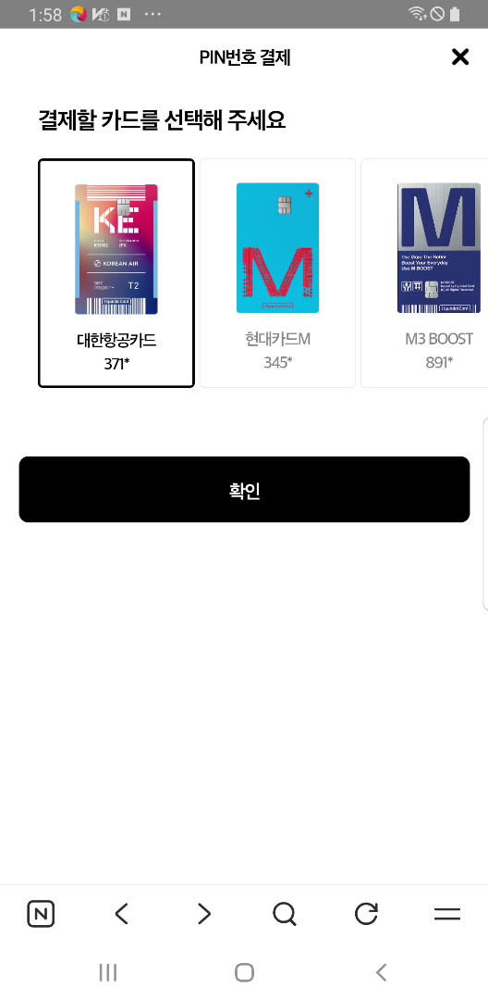

현대카드결제시 비밀번호 입력하고 결제하기 버튼 누르기 전에 먼저 현대카드변경.png 이미지 인식해서 클릭 합니다 
그후 결재목록에서 카드번호 값을 인식해서 현대카드 폴드에  해당 값.png 인식해서  예를들어 값이 333이면 333.png로 이미지 인식해서 클릭합니다 만약에 화면에 해당이미지 없으면  참고해서 606 564 근처에서 오른쪽으로 조금식 스크롤 합니다 즉 터치로 왼쪽으로 당기고 오른쪽으로 스크롤이 필요합니다  스크롤 하면서 이미지 인식해서 클릭 합니다  최대 5번 까지 

그후 현대 확인1.png 확인2.png  확인3.png  확인4.png  중하나 인식해서 클릭 합니다 

그후 현재결제하기 부터 기존과 동일합니다 